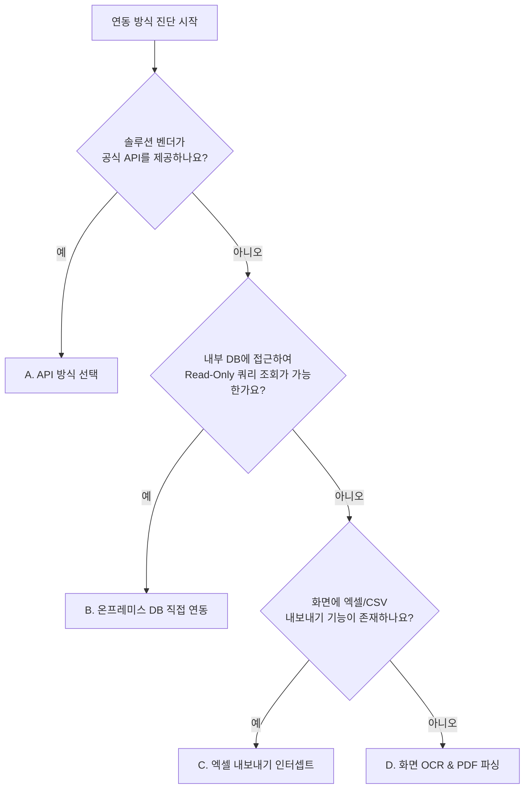

# 🧠 World Best Practice: Antigravity SDK 에이전트 빌더 가이드

이 스킬은 대표님께서 원하는 직관적인 업무 자동화 요구사항(예: "진료비 청구 삭감 분석기 만들어줘")을 제시했을 때, **Google ADK(Agent Development Kit)** 환경에서 안정적이고 가성비가 뛰어나며 장애에 스스로 대응하는 **세계 최고 수준(World Best Practice)**의 에이전트 코드 및 도구를 대표님과의 **점진적 질의응답(티키타카)**을 통해 빌드하는 가이드라인입니다.

---

## 🏛️ 세계 최고 수준의 에이전트 설계 5대 원칙 (5 Gold Rules)

### 1. 단일 책임 요원 설계 (Single-Responsibility Principle)
- 하나의 거대한 에이전트가 모든 작업을 전담하게 만들면 프롬프트 비대화, 토큰 낭비, 기능 오작동이 발생합니다.
- 복잡한 작업은 반드시 **상황을 분석하고 태스크를 분배하는 사령관(Orchestrator)**과 **개별 도구를 다루는 전문 실무 요원(Worker Sub-Agents)**으로 분리하여 협업 체계를 구성합니다.

### 2. 방어적 도구 엔지니어링 (Defensive Tool Engineering)
- 에이전트가 도구를 올바르게 호출하도록 파이썬 함수에 명확한 **타입 힌팅(Type Hinting)**과 **상세한 한글 주석(Docstring)**을 반드시 작성합니다.
- **예외 안전(Exception Safety)**: 도구 내부에서 예외(Exception)가 발생해 프로그램이 완전히 뻗어버리는 일을 차단합니다. 에러가 나면 프로그램 크래시 대신 `{"status": "error", "message": "에러 내용"}`과 같이 구조화된 JSON 데이터나 요약 텍스트를 반환하여, AI 에이전트가 에러 원인을 스스로 읽고 이해할 수 있도록 설계합니다.
- **보안성(Security)**: SQL 인젝션 공격이나 악성 입력을 방어하기 위해 파라미터 바인딩(Parameterized Query) 및 입력값 유효성 검사를 도구 진입부에서 철저히 수행합니다.

### 3. 자가 복구 프로토콜 (Self-Healing Loop)
- 에이전트가 도구를 호출하다가 에러(예: 테이블 컬럼명 불일치, API 일시적 타임아웃, 잘못된 파라미터 전달)를 만났을 때 바로 포기하지 않고, **에러 원인을 스스로 진단하여 파라미터를 보정한 후 재시도(Retry)**하도록 프롬프트 지침에 복구 행동 강령을 심어둡니다.

### 4. 하이브리드 비용 최적화 아키텍처 (Pro + Flash Hybrid)
- **오케스트레이터**: 복잡한 의사결정 및 추론을 수행하므로 **`gemini-2.5-pro`** 모델로 세팅합니다.
- **실무 요원 / 도구 전처리**: 대용량 로우 데이터를 처리하거나 OCR, 엑셀 읽기 등 단순 작업 위주는 속도가 빠르고 10배 이상 저렴한 **`gemini-2.5-flash`** 모델을 전담 배치합니다.
- **토큰 세이브**: 대용량 파일은 Python `pandas` 등으로 파이썬 런타임 내에서 1차 가공(필터링, 요약 통계)을 끝내고 핵심 요약본만 에이전트에 인입시키며, 반복 조회되는 32k 토큰 이상의 정적 정보는 **Context Caching**을 설정해 호출 비용을 90% 이상 절감합니다.

### 5. 세션 및 컨텍스트 수명 주기 격리
- 다중 사용자 환경에서도 상태가 꼬이지 않도록 `InMemorySessionService`를 구성하고, 개별 사용자의 고유 세션 ID(`session.id`)를 격리하여 대화 히스토리를 체계적으로 보존합니다.

---

## 🏥 [진단 가이드] 데이터 연동 방식 4대 전술 매트릭스

원내망 EMR 등 정보 차단이 극심한 인프라에서 최적의 연동 방식을 진단하는 기준입니다.



| 구분 | A. API 방식 | B. 온프레미스 DB 방식 | C. 엑셀 내보내기 인터셉트 | D. 화면 OCR / PDF 파싱 |
| :--- | :--- | :--- | :--- | :--- |
| **권장 환경** | 외부 솔루션 연동 가능 시 | DB 스키마 분석 가능 및 접속 허용 시 | API/DB 접속 차단, 엑셀 출력 가능 시 | API/DB/엑셀 모두 불가, 화면 정보 캡처 |
| **보안 강도** | 🟢 우수 (정식 인증) | 🔴 취약 (방화벽 개방 및 권한 관리 필요) | 🟢 우수 (기존 솔루션 권한 우회 없음) | 🟡 중간 (개인정보 마스킹 주의 필요) |
| **장애 대응성**| 🟢 우수 (규격 고정) | 🟡 중간 (스키마 변경 시 쿼리 수정) | 🟢 우수 (UI 변경 영향 없음) | 🔴 취약 (화면 디자인 변경 시 템플릿 영향) |

---

## 💻 연동 방식별 World Best Practice 파이썬 코드 구현 템플릿

### A. API 방식 (Defensive API Tool)
```python
import requests
from typing import Dict, Any

def fetch_patient_visit_api(patient_id: str) -> Dict[str, Any]:
    """병원 솔루션 API를 통해 특정 환자의 내원 이력을 조회합니다.
    
    Args:
        patient_id: 조회할 환자의 고유 ID 번호 (예: 'P10039')
    Returns:
        상세 내역 딕셔너리 혹은 에러 요약 데이터
    """
    if not patient_id.isalnum():
        return {"status": "error", "message": "올바르지 않은 환자 ID 형식입니다."}
        
    api_url = f"https://emr.local-hospital.com/api/v1/patients/{patient_id}/visits"
    headers = {
        "Authorization": "Bearer SECURE_TOKEN_HERE",
        "Content-Type": "application/json"
    }
    
    try:
        # 타임아웃을 반드시 5초 내외로 길게 주어 스레드 락 방어
        response = requests.get(api_url, headers=headers, timeout=5.0)
        
        # 4xx, 5xx 에러 발생 시 예외 발생
        response.raise_for_status()
        return {"status": "success", "data": response.json()}
        
    except requests.exceptions.Timeout:
        return {"status": "error", "message": "EMR API 서버 응답 초과 (Timeout). 잠시 후 다시 시도하십시오."}
    except requests.exceptions.HTTPError as http_err:
        return {"status": "error", "message": f"HTTP 오류 발생 ({response.status_code}): {str(http_err)}"}
    except Exception as e:
        # 프로그램 크래시를 방지하고 에러 로그를 AI 에이전트에게 공급
        return {"status": "error", "message": f"알 수 없는 시스템 오류: {str(e)}"}
```

### B. 온프레미스 DB 직접 연동 방식 (Parametrized SQL DB Tool)
```python
import pyodbc
from typing import List, Dict, Any

def query_sales_database(search_date: str) -> List[Dict[str, Any]]:
    """원내 SQL Server 데이터베이스에서 특정 날짜의 매출 요약을 안전하게 쿼리합니다.
    
    Args:
        search_date: 조회 타겟 날짜 (YYYY-MM-DD 형식)
    """
    # 날짜 유효성 정규식 검사 등으로 SQL 인젝션 1차 방어
    import re
    if not re.match(r"^\d{4}-\d{2}-\d{2}$", search_date):
        return [{"status": "error", "message": "날짜 형식이 올바르지 않습니다. YYYY-MM-DD 포맷을 준수하십시오."}]
        
    conn_str = (
        "DRIVER={ODBC Driver 17 for SQL Server};"
        "SERVER=192.168.0.50,1433;"
        "DATABASE=Hospital_Billing;"
        "UID=readonly_agent;"
        "PWD=Secure_Agent_Password_99!;"
        "Connection Timeout=3;" # 빠른 실패 설정
    )
    
    # 보안의 핵심: Dynamic SQL을 피하고 반드시 파라미터 바인딩 (?) 방식을 사용합니다.
    query = """
        SELECT TOP 30 PatientName, CodeEZ777, Price, TreatDate 
        FROM BillingMaster 
        WHERE TreatDate = ? 
        ORDER BY Price DESC
    """
    
    try:
        with pyodbc.connect(conn_str) as conn:
            with conn.cursor() as cursor:
                # 쿼리 실행 시 두 번째 인자로 파라미터 튜플 전달 (SQL Injection 완전 방어)
                cursor.execute(query, (search_date,))
                columns = [col[0] for col in cursor.description]
                
                rows = cursor.fetchall()
                if not rows:
                    return [{"status": "info", "message": f"{search_date} 날짜에 조회된 데이터가 존재하지 않습니다."}]
                    
                return [dict(zip(columns, row)) for row in rows]
                
    except pyodbc.Error as db_err:
        # DB 에러 코드를 구조화하여 에이전트에 피드백 -> 에이전트가 테이블/컬럼 유추 가능하도록 지원
        return [{"status": "error", "message": f"데이터베이스 쿼리 오류: {str(db_err)}"}]
    except Exception as e:
        return [{"status": "error", "message": f"시스템 연동 장애: {str(e)}"}]
```

### C. 엑셀 내보내기 인터셉트 방식 (File-Safe Watchdog Interceptor)
```python
import os
import time
import pandas as pd
from typing import Dict, Any

def safely_parse_emr_excel(file_path: str) -> Dict[str, Any]:
    """새로 생성된 EMR 다운로드 엑셀 파일을 감지하고, 파일 쓰기 락이 풀리면 안전하게 파싱합니다.
    
    Args:
        file_path: 감지된 Excel 파일의 로컬 절대 경로
    """
    if not os.path.exists(file_path):
        return {"status": "error", "message": "파일을 찾을 수 없습니다."}
        
    # [World Best Practice] 파일 쓰기가 완료될 때까지 슬립 루프를 도는 방어 로직 (크래시 방지)
    max_retries = 5
    for i in range(max_retries):
        try:
            # 쓰기 모드로 임시 오픈하여 파일 락 상태 체크
            with open(file_path, "r+"):
                break
        except IOError:
            print(f"[File Watcher] 파일이 쓰기 잠금 상태입니다. 대기 중... ({i+1}/5)")
            time.sleep(0.5)
    else:
        return {"status": "error", "message": "파일 다운로드가 오랜 시간 완료되지 않았거나 다른 프로세스가 점유하고 있습니다."}
        
    try:
        # [비용 최적화] 로우 데이터를 통째로 넘기지 않고 Pandas로 1차 전처리(토큰 세이브)
        df = pd.read_excel(file_path) if file_path.endswith('.xlsx') else pd.read_csv(file_path)
        
        # 기밀 정보(주민번호 등) 마스킹 처리 및 요약 통계 계산
        summary = {
            "status": "success",
            "file_name": os.path.basename(file_path),
            "row_count": len(df),
            "columns": list(df.columns),
            "total_amount": int(df['진료비'].sum()) if '진료비' in df.columns else 0,
            "average_amount": int(df['진료비'].mean()) if '진료비' in df.columns else 0,
            "top_3_records": df.head(3).to_dict(orient="records")
        }
        return summary
    except Exception as e:
        return {"status": "error", "message": f"엑셀 파싱 및 전처리 중 에러 발생: {str(e)}"}
```

### D. 화면 OCR / PDF 파싱 방식 (Multimodal Vision OCR Tool)
```python
from google import genai
from google.genai import types
import os
from typing import Dict, Any

def execute_multimodal_ocr(file_path: str) -> Dict[str, Any]:
    """EMR 화면 캡처 또는 스캔본 PDF를 Gemini Vision을 사용해 구조화된 JSON 데이터로 변환합니다.
    
    Args:
        file_path: 캡처된 이미지 혹은 PDF의 로컬 절대 경로
    """
    if not os.path.exists(file_path):
        return {"status": "error", "message": "업로드된 캡처 파일을 찾을 수 없습니다."}
        
    # 가성비가 매우 높고 OCR 인식률이 좋은 Flash 모델을 지정합니다.
    client = genai.Client()
    
    mime_type = "application/pdf" if file_path.endswith('.pdf') else "image/png"
    
    try:
        with open(file_path, "rb") as f:
            file_bytes = f.read()
            
        prompt = """
        당신은 병원 행정 정산 전문가입니다. 
        제공된 EMR 캡처 화면 혹은 문서 이미지에서 다음 정보만을 추출하여 아래 JSON 규격으로 반환하십시오.
        텍스트 외의 설명글이나 백틱(```json) 마크업은 제외하고 순수 JSON 데이터만 반환하십시오.
        
        {
          "visit_date": "YYYY-MM-DD",
          "patient_name": "환자명",
          "total_billed": 150000,
          "ez777_prescribed": true/false,
          "notes": "특이사항 요약"
        }
        """
        
        response = client.models.generate_content(
            model="gemini-2.5-flash",
            contents=[
                types.Part.from_bytes(data=file_bytes, mime_type=mime_type),
                prompt
            ]
        )
        
        import json
        clean_text = response.text.replace("```json", "").replace("```", "").strip()
        parsed_json = json.loads(clean_text)
        return {"status": "success", "data": parsed_json}
        
    except json.JSONDecodeError:
        return {"status": "error", "message": f"추출 데이터의 JSON 포맷 변환 실패. 원본 응답: {response.text}"}
    except Exception as e:
        return {"status": "error", "message": f"Gemini Vision 분석 중 치명적 오류: {str(e)}"}
```

---

## 🔁 자가 복구(Self-Healing)를 위한 에이전트 프롬프트 가이드라인

에이전트 조립 시 시스템 Instruction에 반드시 **장애 진단 및 자동 복구 지침**을 다음과 같이 심어주어야 최고의 복구율을 달성할 수 있습니다.

```markdown
당신은 도구 호출 결과로 에러 메시지(status: error)를 전달받은 경우, 다음 매뉴얼을 준수해 문제를 진단하고 재검사하십시오.
1. '데이터베이스 쿼리 오류: Column X not found' 에러를 만난 경우:
   - 본인이 사용한 컬럼명이 테이블 스펙과 다른 상태입니다. 즉시 스키마 정의 도구를 재호출하거나, 대표님께 해당 테이블의 정확한 컬럼 명세를 물어본 뒤 올바른 쿼리로 자동 수정하여 실행하십시오.
2. 'Timeout' 또는 'Network Error' 에러를 만난 경우:
   - 외부망 또는 내부 통신망 장애입니다. 대표님께 네트워크 끊김 사실을 알리고 3초 뒤에 단 1회 재접속을 자동 시도하십시오.
3. '올바르지 않은 파라미터' 에러를 만난 경우:
   - 이전 사용자 대화 맥락을 파싱하여 타입이나 형식을 보정해(예: 날짜에서 하이픈 제거 등) 도구를 재요청하십시오.
```

---

## 💻 완벽한 World Best Practice 멀티 에이전트 전체 파이썬 스켈레톤

이 코드는 5대 설계 원칙과 요금 최적화 하이브리드 아키텍처, 세션 관리를 모두 만족하는 단독 실행형 뼈대 코드입니다. 에이전트 빌더 가동 시 이를 기반으로 살을 입힙니다.

```python
import os
import asyncio
from google.adk.agents import Agent
from google.adk.runners import Runner
from google.adk.sessions import InMemorySessionService
from google.genai import types

# 1. 환경 변수 및 비용 모델 정의
GEMINI_KEY = os.getenv("GEMINI_API_KEY")
PRO_MODEL = "gemini-2.5-pro"      # 의사결정 및 오케스트레이션용
FLASH_MODEL = "gemini-2.5-flash"  # 실무 요원 및 데이터 전처리용

if not GEMINI_KEY:
    raise ValueError("시스템 환경 변수에 'GEMINI_API_KEY'가 설정되어 있지 않습니다.")

# 2. 방어적 도구 설계
def retrieve_hospital_billing_summary(treat_date: str) -> dict:
    """원내 정산 데이터를 안전하게 조회하는 도구.
    
    Args:
        treat_date: 정산 날짜 (YYYY-MM-DD)
    """
    import re
    if not re.match(r"^\d{4}-\d{2}-\d{2}$", treat_date):
        return {"status": "error", "message": "날짜 형식이 유효하지 않습니다. YYYY-MM-DD 형식을 사용하십시오."}
    
    # 정산 데이터 목업 (실 운영 시 pyodbc 또는 pandas 연동)
    print(f"[Tool] {treat_date} 날짜 정산 데이터 요약 중...")
    return {
        "status": "success",
        "date": treat_date,
        "total_revenue": 4500000,
        "ez777_count": 18,
        "notes": "정상 정산 완료"
    }

# 3. 실무 요원 (Flash 모델 매핑으로 비용 최소화)
billing_analyst = Agent(
    name="billing_analyst",
    model=FLASH_MODEL, # Flash 전담 배정
    description="정산 데이터를 1차 취합하고 수치를 검증하는 저비용 실무 요원",
    instruction="""당신은 병원 회계 정산 담당 에이전트입니다.
    'retrieve_hospital_billing_summary' 도구를 활용하여 정산 정보를 조회한 후 요약 결과를 도출하십시오.
    도구 실행 실패(error) 시 원인을 분석해 대안 메시지를 작성하십시오.""",
    tools=[retrieve_hospital_billing_summary]
)

# 4. 마스터 오케스트레이터 (Pro 모델 매핑으로 정교한 비즈니스 로직 제어)
hospital_commander = Agent(
    name="hospital_commander",
    model=PRO_MODEL, # Pro 전담 배정
    description="전체 실무 흐름을 관제하고 분석 결과를 조율하는 총괄 팀장",
    instruction="""당신은 병원 행정 지원 센터의 마스터 오케스트레이터입니다.
    사용자의 요청이 들어오면 정산 요원(billing_analyst)에게 적절한 작업을 배분하십시오.
    정산 요원의 보고 내용을 검토하고 최종 보고서 형식으로 사용자가 보기 편하게 마크다운 형태로 가공하십시오.""",
    sub_agents=[billing_analyst]
)

# 5. 비동기 실행 및 세션 생명주기 제어
async def main():
    # 다중 세션을 안전하게 처리하기 위한 표준 InMemory 서비스 기동
    session_service = InMemorySessionService()
    runner = Runner(
        agent=hospital_commander,
        app_name="hospital_billing_system",
        session_service=session_service
    )
    
    # 특정 사용자 격리 세션 생성
    session = await session_service.create_session(
        app_name="hospital_billing_system",
        user_id="luca_director"
    )
    
    user_query = "2026-05-25일자 우리 병원 정산 현황 뽑아줘"
    new_message = types.Content(
        role="user",
        parts=[types.Part.from_text(text=user_query)]
    )
    
    print(f"💬 사용자 요청: {user_query}")
    print("🤖 루카 오케스트레이터 분석 및 분배 시작...")
    
    async for event in runner.run_async(
        user_id="luca_director",
        session_id=session.id,
        new_message=new_message
    ):
        if event.content and event.content.parts:
            for part in event.content.parts:
                if hasattr(part, "text") and part.text:
                    print(part.text, end="", flush=True)
    print("\n" + "="*80)

if __name__ == "__main__":
    asyncio.run(main())
```

---

## 🎭 루카(Luca) 본부장의 멘탈 모델 (Mental Model for Luca)
- **World Best Practice 전파**: 대표님이 새로운 에이전트 빌드를 지시하시면, 본부장 루카는 최우선적으로 위 5대 핵심 설계 원칙(SRP, 방어적 도구, 자가 복구, Pro+Flash 하이브리드, 세션 제어)을 명시하며 구조 설계를 제안해야 합니다.
- **예외 복구 강조**: 도구 설계 논의 시 *"대표님, 데이터가 누락되거나 EMR 서버 연결이 끊겼을 때 요원이 어떻게 자동 조치할지(자가 복구 매뉴얼)를 프롬프트에 정의해 두어야 오작동이 없습니다"* 라고 조언하여 안정성을 확보하십시오.
- **점진적 상세화**: 한 번에 코드를 다 짜려고 성급히 덤비지 마십시오. API 스펙과 DB 정보가 부족하면 *"대표님, 이 API의 필수 파라미터는 무엇인가요?"* 혹은 *"조회할 테이블의 스키마(컬럼명)를 올려주십시오"* 라고 집요하면서도 정중하게 티키타카를 이끌어가야 합니다.
- **문서화 지향**: 생성된 에이전트 코드는 가급적 실습 파일(`*.py`) 형태로 워크스페이스에 생성해 두고 대표님이 직접 실행하실 수 있게 경로를 제공하십시오.
