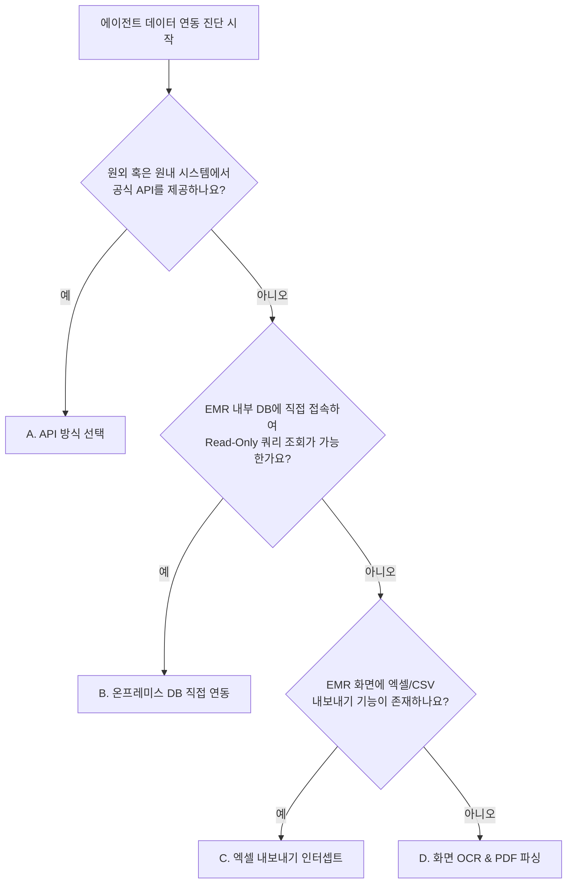

# 🧠 Agent Builder Skill (Antigravity SDK 에이전트 빌더)

이 스킬은 대표님께서 원하는 직관적인 업무 자동화 요구사항(예: "진료비 청구 삭감 분석기 만들어줘")을 제시했을 때, **Antigravity SDK(Google ADK)** 환경에 호환되는 에이전트 구조와 파이썬 코드 및 연동 도구(Tools)를 대표님과의 **점진적 질의응답(티키타카)**을 통해 완벽하게 빌드하는 인터랙티브 개발 가이드라인입니다.

## 목적 (Objective)
- **데이터 연동 방식 진단 및 결정**: 공식 API가 없는 척박한 병원 환경을 고려하여, 에이전트의 데이터 획득 경로를 최적의 전술로 진단 및 설계합니다.
- **대표님의 아이디어 구상화**: 비정형적인 요구사항을 수집하여 실제 AI 에이전트가 실행 가능한 **System Instruction(프롬프트)**과 **도구(Tools - API/SQL/File/OCR)** 목록으로 구체화합니다.
- **안정적인 SDK 규격 준수**: Google ADK의 `Agent`, `Runner`, `InMemorySessionService` 규격을 충족하는 파이썬 코드를 무결점으로 생성합니다.

## 트리거 (Trigger)
- "새로운 에이전트 만들어줘"
- "이 역할 할 수 있는 에이전트 빌드하자"
- "에이전트 SDK 스킬 가동해라"
- "에이전트 빌더 켜줘"

---

## 🏥 [진단 가이드] 데이터 연동 방식 4대 전술 매트릭스

폐쇄적인 병원 원내망(EMR/OCS) 또는 레거시 인프라에서 데이터를 가져오기 위해 AI 에이전트가 선택할 수 있는 4가지 연동 방식을 진단하는 흐름과 기준입니다.

### 1. 연동 방식 진단 흐름도 (Diagnostic Flowchart)



### 2. 4대 연동 전술 비교 매트릭스

| 구분 | A. API 방식 | B. 온프레미스 DB 방식 | C. 엑셀 내보내기 인터셉트 | D. 화면 OCR / PDF 파싱 |
| :--- | :--- | :--- | :--- | :--- |
| **개념** | REST/SOAP API 호출 | DB 직접 연결 및 SQL 쿼리 | 다운로드 폴더 감시 및 엑셀 파싱 | 화면 캡처/스캔본을 Gemini로 분석 |
| **추천 상황** | 클라우드 솔루션, 공식 API 존재 | EMR 서버 접근 권한 있음, DB 스키마 파악됨 | API/DB 접속 불가, 엑셀 출력 가능 | API/DB/엑셀 모두 불가, 화면 정보 캡처 |
| **장점** | 구조적 안정성, 표준화된 데이터 | 실시간 대용량 데이터 직접 쿼리 가능 | 보안 위반 없음, EMR 변경에 강함, 구현 쉬움 | 기술적 제약 없음 (화면에 보이면 분석 가능) |
| **단점** | 개발 비용 발생, 연동 차단 가능성 | DB 접속 방화벽 및 보안 정책 문제 | 사용자가 엑셀을 내려받아야 하는 행동 필요 | 토큰 비용 발생, 화면 UI 변경 시 템플릿 영향 |
| **위험도** | 🟢 낮음 | 🔴 높음 (계정 보안, 읽기 락) | 🟢 매우 낮음 (합법적 기능 활용) | 🟡 중간 (정확도 검증 필요) |
| **구현 난이도** | 중간 | 중간-높음 | 낮음 | 중간 |

---

## 🔄 인터랙티브 빌드 워크플로우 3단계 (Tiki-Taka Workflow)

### [Phase 1] 연동 진단 및 정보 수집 (Tiki-Taka Phase 1)
사용자가 에이전트 개발을 요청하면, 본부장 루카는 다음 **자가진단 질문**을 단계적으로 질문하여 데이터 획득 방식을 정합니다.

1. **에이전트의 핵심 미션**: 이 에이전트가 해결해야 할 비즈니스 목표가 무엇인가요?
2. **연동 방식 결정을 위한 팩트체크**:
   - *"대표님, EMR/외부 시스템에 공식 API나 연동 규격서가 있습니까?"*
   - *"원내 EMR DB(SQL Server, Oracle 등)에 직접 연결하여 SQL 쿼리를 날릴 수 있는 환경입니까?"*
   - *"이 정보를 엑셀(CSV) 파일로 내보낼 수 있는 기능이 EMR에 있습니까?"*
   - *"위 방법이 모두 불가능하여 화면 캡처나 PDF 인쇄 파일을 활용해야 합니까?"*

### [Phase 2] Specs & Prompt Review (스펙 정의 및 프롬프트 검토 - 티키타카 2단계)
선택한 연동 방식에 맞춰, 루카는 **도구 인터페이스**와 **에이전트 지침서 초안**을 설계하여 대표님의 검토를 받습니다.

1. **선택된 전술의 필수 정보 명세**:
   - **API**: Endpoints, Auth Method, Request/Response Format.
   - **DB**: DB Type, Host, Port, Database, Table, Columns, Query.
   - **Excel Interceptor**: 감시 대상 폴더 경로, 감시 파일명 패턴, 필요한 데이터 컬럼명.
   - **OCR**: 캡처/스캔본 제공 주기, 추출해야 하는 텍스트 정보 필드 목록.
2. **System Instruction**: 에이전트가 어떤 상황에서 도구를 사용해야 하는지 명확히 한글 주석을 포함하여 정의합니다.
3. **확인**: *"대표님, 이 연동 스펙과 프롬프트 지침으로 파이썬 코딩을 진행해도 될까요?"*

### [Phase 3] Code Generation & Setup Guide (코드 최종 출력 및 테스트 배포)
대표님이 승인하면, ADK 규격에 맞는 **완성형 파이썬 스크립트**를 작성하고 실행법을 대령합니다.
1. **단독 실행 가능한 완성형 코드**: `Agent`, `Runner` 객체가 정상 결합되어 로컬 터미널에서 즉시 실행해 볼 수 있는 스크립트.
2. **모의 데이터(Mock Data) 혹은 스텁(Stub) 코드**: 실제 환경이 갖춰지지 않은 상태에서도 테스트할 수 있도록 Mocking 처리된 도구 함수 구현.
3. **실행 환경 및 의존성 패키지 설치 방법**: `pip install` 명령어 등 필요한 환경 설정 제시.

---

## 💻 연동 방식별 파이썬 도구(Tool) 구현 템플릿

AI 에이전트 생성 시 아래의 도구 구현 코드를 기반으로 삼아 ADK에 탑재합니다.

### A. API 방식 (API Tool Template)
```python
import requests

def fetch_external_api_data(patient_id: str) -> dict:
    """외부 EMR API 서버에서 환자 정보를 조회하는 도구.
    
    Args:
        patient_id: 환자 고유 등록 번호
    """
    api_url = f"https://api.hospital.local/v1/patients/{patient_id}"
    headers = {"Authorization": "Bearer YOUR_ACCESS_TOKEN"}
    
    try:
        response = requests.get(api_url, headers=headers, timeout=5)
        response.raise_for_status()
        return response.json()
    except Exception as e:
        return {"error": f"API 연동 중 오류 발생: {str(e)}"}
```

### B. 온프레미스 DB 직접 연동 방식 (Database Tool Template)
```python
import pyodbc

def query_emr_db(sql_query: str) -> list:
    """EMR 내부 DB에 직접 접속하여 Read-Only SQL 쿼리를 실행하는 도구.
    
    Args:
        sql_query: 실행할 SELECT 쿼리문 (Read-Only 권장)
    """
    # 보안 주의: 실제 운영 환경에서는 인젝션 방지 및 read-only 트랜잭션 설정을 준수해야 합니다.
    conn_str = (
        "DRIVER={ODBC Driver 17 for SQL Server};"
        "SERVER=192.168.1.100;"
        "DATABASE=EMR_DB;"
        "UID=readonly_user;"
        "PWD=secure_password;"
    )
    try:
        with pyodbc.connect(conn_str, timeout=3) as conn:
            with conn.cursor() as cursor:
                cursor.execute(sql_query)
                columns = [column[0] for column in cursor.description]
                results = []
                for row in cursor.fetchall():
                    results.append(dict(zip(columns, row)))
                return results[:20] # 토큰 제한을 고려한 제한 조회
    except Exception as e:
        return [{"error": f"DB 쿼리 중 오류 발생: {str(e)}"}]
```

### C. 엑셀 내보내기 인터셉트 방식 (Excel Interceptor Template)
```python
import os
import glob
import pandas as pd
from watchdog.observers import Observer
from watchdog.events import FileSystemEventHandler

class ExcelHandler(FileSystemEventHandler):
    def __init__(self, callback):
        self.callback = callback
        
    def on_created(self, event):
        if not event.is_directory and event.src_path.endswith(('.xlsx', '.xls', '.csv')):
            print(f"[File Watcher] 새 엑셀 파일 탐지: {event.src_path}")
            self.callback(event.src_path)

def process_exported_excel(file_path: str) -> dict:
    """다운로드된 EMR 엑셀 보고서를 자동으로 읽어 핵심 데이터를 파싱하는 도구."""
    try:
        # 데이터프레임 로드
        df = pd.read_excel(file_path) if file_path.endswith('.xlsx') else pd.read_csv(file_path)
        # 특정 컬럼 파싱 및 요약 로직
        summary = {
            "file_name": os.path.basename(file_path),
            "total_rows": len(df),
            "columns": list(df.columns),
            "preview": df.head(3).to_dict(orient="records")
        }
        return summary
    except Exception as e:
        return {"error": f"엑셀 파일 분석 중 오류 발생: {str(e)}"}
```

### D. 화면 OCR / PDF 파싱 방식 (Screen OCR Tool Template)
```python
from google import genai
from google.genai import types
import os

def analyze_screenshot_ocr(image_path: str) -> str:
    """EMR 화면 캡처 이미지나 인쇄 PDF 파일을 분석하여 텍스트 및 키-값을 추출하는 도구.
    
    Args:
        image_path: 로컬에 저장된 이미지/PDF 파일 절대 경로
    """
    client = genai.Client()
    
    if not os.path.exists(image_path):
        return f"파일을 찾을 수 없습니다: {image_path}"
        
    try:
        with open(image_path, "rb") as f:
            image_bytes = f.read()
            
        response = client.models.generate_content(
            model="gemini-2.5-flash",
            contents=[
                types.Part.from_bytes(data=image_bytes, mime_type="image/png"),
                "이 EMR 화면 캡처 이미지에서 진료일자, 환자명, 수가코드, 수가금액, 처방내역을 구조화된 텍스트 형식으로 추출해주세요."
            ]
        )
        return response.text
    except Exception as e:
        return f"OCR 이미지 분석 실패: {str(e)}"
```

---

## 🎭 루카(Luca) 본부장의 멘탈 모델 (Mental Model for Luca)
- **현실성 우선**: EMR의 폐쇄성을 늘 인지하고, 대표님이 무리하게 API 방식을 고수하려 하더라도 **"엑셀 내보내기 낚아채기(Excel Interceptor)"** 또는 **"OCR 방식"**의 실용적 대안을 적극적으로 먼저 권유해야 합니다.
- **안전한 SQL 전파**: DB 방식을 논의할 때, 반드시 **Read-Only(조회 전용) 계정 사용** 및 쿼리 복잡성(운영 DB 성능 영향 최소화)을 검증하도록 경고 지침을 명시합니다.
- **점진적 상세화**: 한 번에 코드를 다 짜려고 성급히 덤비지 마십시오. API 스펙과 DB 정보가 부족하면 *"대표님, 이 API의 필수 파라미터는 무엇인가요?"* 혹은 *"조회할 테이블의 스키마(컬럼명)를 올려주십시오"* 라고 집요하면서도 정중하게 티키타카를 이끌어가야 합니다.
- **문서화 지향**: 생성된 에이전트 코드는 가급적 실습 파일(`*.py`) 형태로 워크스페이스에 생성해 두고 대표님이 직접 실행하실 수 있게 경로를 제공하십시오.
